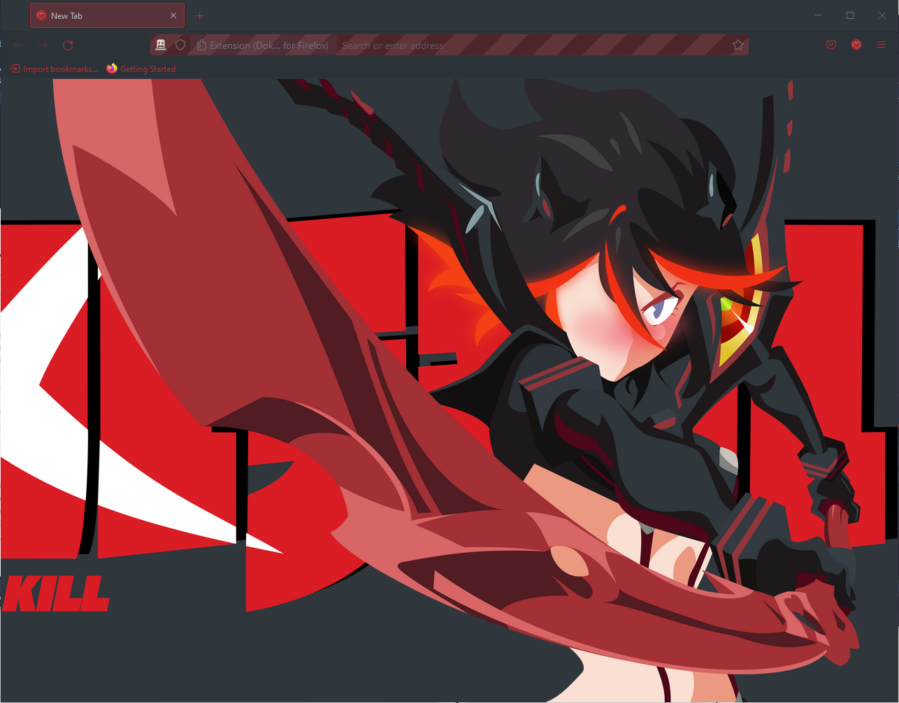
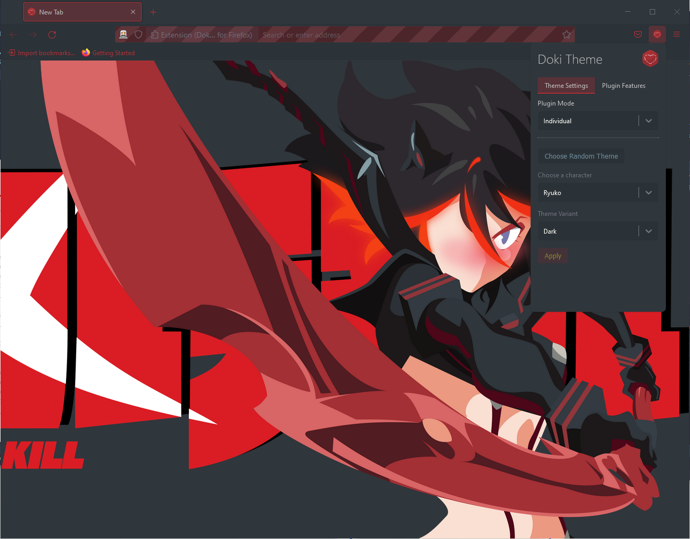
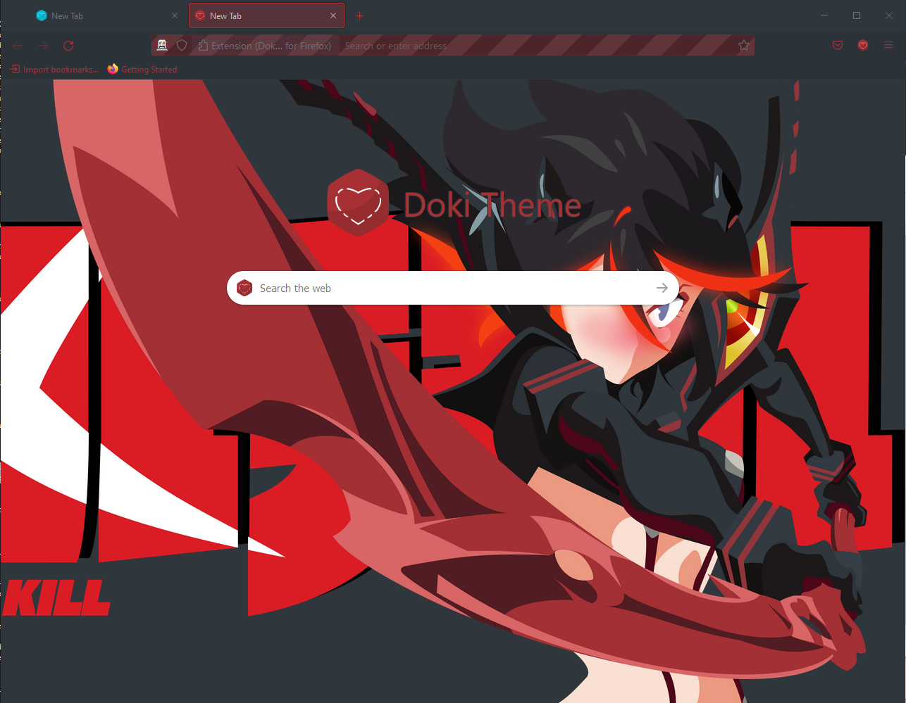

## The Doki Theme: Firefox

## Quick Theme Preview

---

# Documentation

- [Installation](#installation)
- [Usage](#usage)
  - [New Tab Override](#new-tab-override)
  - [Modes](#modes)
    - [Individual](#individual)
    - [Device Match](#device-match)
    - [Mixed](#mixed)
  - [Plugin Features](#plugin-features)
- [Miscellaneous](#miscellaneous)
  - [Contributing](#contributing)
  - [Reviewing](#reviewing)
  - [Theme Requests](#theme-requests)
  - [Helping the community](#enjoying-the-themes)
  - [Feature Requests](#contributions)

# Installation

### Prerequisites

- Mozilla Firefox 95 or above

### Mozilla's Add-on Store

You can install the extension from
the [FireFox addon marketplace.](https://addons.mozilla.org/en-US/firefox/addon/doki-theme-for-firefox/)

# Usage

You can configure the extension by opening the popup menu & clicking:

- The Doki Theme logo located at the top.

## New Tab Override

The Doki Theme for Firefox is configured to override your browser's New Tabs and Home Screen.
Replacing the default tab with an esthetically pleasing asset of your chosen character.

## Modes

The Doki Theme for Firefox supports various modes that control how your browser is themed.
Below you can read how each of the modes behave and can be configured.

### Individual

This mode is for weebs who are dedicated to their one special character.
Every new tab will be themed with your chosen one.

**Choose Random Theme**: Don't have a special character, no worries, just click this button, and I'll choose for you.
You'll get either a dark or light theme, and a chance to get secondary content (if that theme has secondary content).

### Device Match

**Important:** The Doki Theme needs your permission to modify your browser settings to match the "System" setting for
this feature to work.

This way I can change your theme when your device's system setting changes from `Dark` to `Light` or vice versa.

You have the ability to choose a light theme for when your device is in light mode, and a dark theme for when your
device is in dark mode.

### Mixed

This mode is for weebs who savor the variety of life.
Every new tab will be themed randomly by a chosen theme from your selected theme pool.

**Theme Pools**:

- **All Themes**: A tab's theme will be randomly selected from all the themes provided by this version of the plugin.
- **Dark Only**: A tab's theme will be randomly selected from all the dark the themes provided by this version of the
  plugin.
- **Light Only**: A tab's theme will be randomly selected from all the light the themes provided by this version of the
  plugin.
- **Match Device**: A tab's theme will be randomly selected from all the light the themes provided by this version of
  the plugin if your device is in `Light Mode`. Or a tab's theme will be randomly selected from all the dark the themes
  provided by this version of the plugin if your device is in `Dark Mode`

## Plugin Features

**Show Search Widget**: controls the presence of the search widget on the `New Tab` page.

### Content Injection

**Important**: this feature requires access to your browser's active tab and all the data in it, to support this
feature.

This way the plugin can manually inject styles to match your active tab's theme. For that extra immersive experience.

**Inject Themed Text Selection**: injects styles to change the text selection colors & caret to match the active tab's
theme.

**Inject Themed Scrollbar**: injects styles to change the scrollbar to match the active tab's theme.

# Miscellaneous

## Contributing

If you want to get your workstation set up to work on the plugin,
then you'll want to check out the [CONTRIBUTING.md](./CONTRIBUTING.md) for instructions on what is needed.

## Reviewing

If you are currently reviewing this plugin then you'll want to check out the [REVIEWER_README.md](./REVIEWER_README.md)
for instructions on what is needed complete the review.

## Theme Requests

If you want your main squeeze to be featured in the Doki Theme suite, feel free
to [submit a theme request](https://github.com/doki-theme/doki-master-theme/issues).

## Enjoying the themes?

Great! I am glad you like it!

Be sure to ⭐ and share it with other weebs!

## Contributions?

I think your voice needs to be heard! You probably have good ideas, so feel free to submit your feedback
as [an issue](https://github.com/doki-theme/doki-theme-jupyter/issues/new).

Help make this plugin better!
